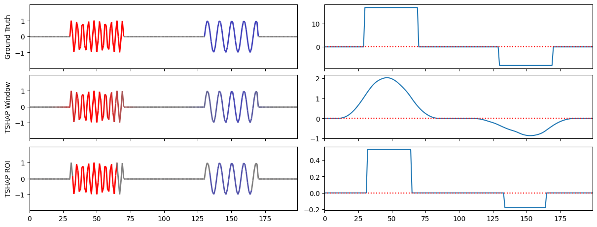

# tshap
TSHAP is a SHAP-based attribution method for time series classification and regression. The attributions can be used to explain the prediction of the time series model. TSHAP has two variants: TSHAP-Window and TSHAP-ROI. It supports both univariate and multivariate time series data.

 

To use TSHAP, include the source [Python module](tshap/tshap.py) or install with Pypi.
```
pip install tshap
```
Examples can be found in the [Jupyter notebook](tshap.ipynb).


This repo accompanies our ECML-PKDD 2025 research track paper [TSHAP: Fast and Exact SHAP for Explaining Time Series Classification and Regression](<https://www.researchgate.net/publication/392833501_TSHAP_Fast_and_Exact_SHAP_for_Explaining_Time_Series_Classification_and_Regression>).


## Citation

If you use this repository in your research, please cite as:
```
@misc{lenguyen2025tshap,
    title={[TSHAP: Fast and Exact SHAP for Explaining Time Series Classification and Regression},
    author={Thach Le Nguyen and Georgiana Ifrim},
    year={2025},
    conference={ECMLPKDD},
    eprint={https://www.researchgate.net/publication/392833501_TSHAP_Fast_and_Exact_SHAP_for_Explaining_Time_Series_Classification_and_Regression},
    archivePrefix={arXiv},
    primaryClass={cs.LG}
}
```
